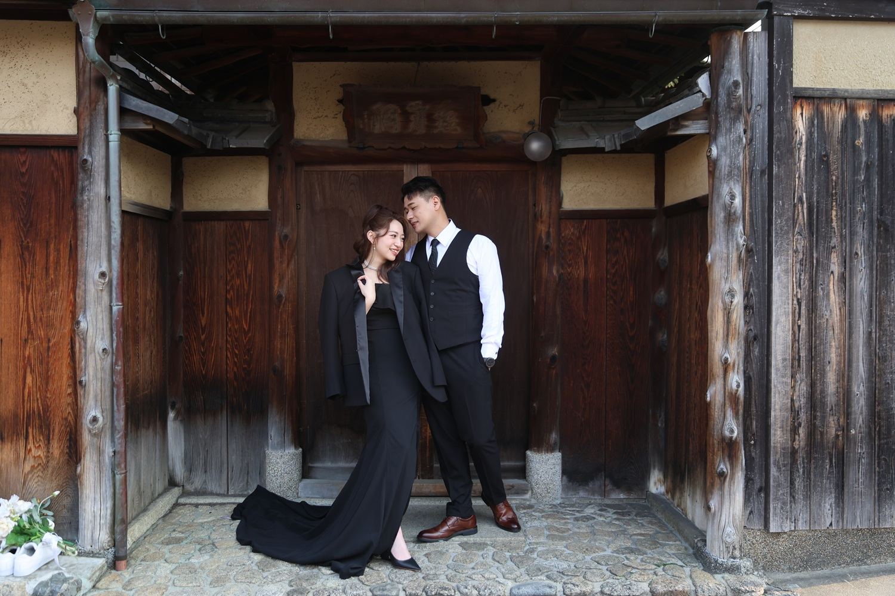

# Fei Lin Bridal Makeup & Hair Website

Single-page responsive portfolio & contact site built from the HTML5 UP "Big Picture" template, refactored for performance, accessibility, and maintainability.

## Key Features
- Fast initial load (deferred JS, image lazy loading, font + hero preloads)
- Mobile-first responsive layout with persistent top navigation
- Lightbox gallery powered by Poptrox
- Scroll-triggered reveal animations via Scrollex (About section stays visible after first reveal)
- Accessible semantic HTML (landmarks, descriptive alt text, form labels placeholders)
- Contact form integrated with Formspree

## Tech Stack
- HTML5, CSS3 + Sass (`assets/sass` sources compiled to `assets/css/main.css` & `main.min.css`)
- jQuery + lightweight plugins (Poptrox, Scrollex, Breakpoints, Browser utils)
- Font Awesome (self-hosted webfonts subset)

## Performance / Optimization Notes
- Removed unused smooth scrolling plugin (`jquery.scrolly`) for immediate anchor navigation
- Images use `loading="lazy"` & `decoding="async"`; hero images preloaded for LCP
- Critical fonts & hero images preloaded; Google Fonts uses `display=swap`
- Minified production stylesheet `main.min.css` generated via Sass

## Structure Overview
```
index.html
assets/css/            # main.css (expanded), main.min.css (compressed build output)
assets/sass/           # Modular Sass source
assets/js/             # Core JS + plugins
images/                # Portfolio images (full + thumbs)
other/                 # Logo, favicon, about image
package.json           # Sass build scripts
```

## Build (Sass)
Install dependencies (first time):
```powershell
npm install
```
Develop with watch:
```powershell
npm run sass:watch
```
One-off dev build (expanded) + production minified CSS:
```powershell
npm run build
```
Outputs:
- `assets/css/main.css` (readable)
- `assets/css/main.min.css` (compressed, referenced by `index.html`)

## Local Development
You can open `index.html` directly, or run a static server:
```powershell
python -m http.server 8000
# or
npx serve .
```
Visit: http://localhost:8000

## Updating Gallery
Add full-size images to `images/fulls/` and matching thumbnails to `images/thumbs/` with identical filenames. Then append new `<a class="gallery-img ...">` items in the gallery markup.

## Accessibility Checklist
- Descriptive alt text
- Sufficient color contrast (verify after palette changes)
- Keyboard navigable gallery & form
- Focus styles retained via browser defaults

## Deployment
Upload all files (including `assets/css/main.min.css`). No server build step required if you commit compiled CSS.

## Maintenance Next Ideas
- Generate WebP/AVIF variants for images
- Prune unused Font Awesome glyphs (subset build) to shrink font size
- Add CI for HTML/CSS validation + Lighthouse budget
- Consider prefetching next-section images on idle

## Image Optimization (WebP / AVIF)
To reduce bandwidth, you can generate modern formats alongside existing JPGs:

1. Install sharp (optional dev dependency):
```powershell
npm install --save-dev sharp
```
2. Create a simple PowerShell script or Node script to batch convert:
```powershell
# Example PowerShell (convert full images to WebP quality 82)
Get-ChildItem images/fulls/*.jpg | ForEach-Object {
  $dest = $_.FullName.Replace('.jpg','.webp');
  magick $_.FullName -quality 82 $dest
}
```
(Requires ImageMagick; or use a Node sharp script.)
3. Update gallery markup to use `<picture>` for each image:
```html
<picture>
  <source srcset="images/fulls/01.webp" type="image/webp" />
  
</picture>
```
Keep thumbnails similarly.

## License
Template: Creative Commons Attribution 3.0 (HTML5 UP). Custom modifications © 2025 Fei Lin.
